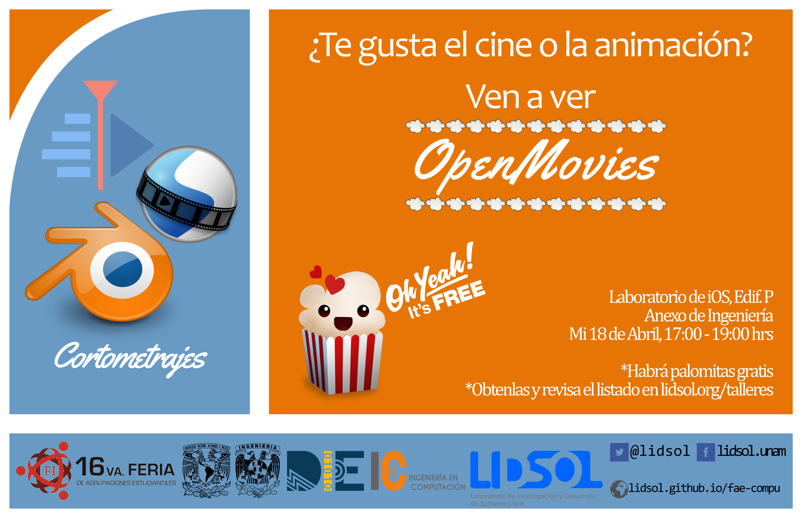
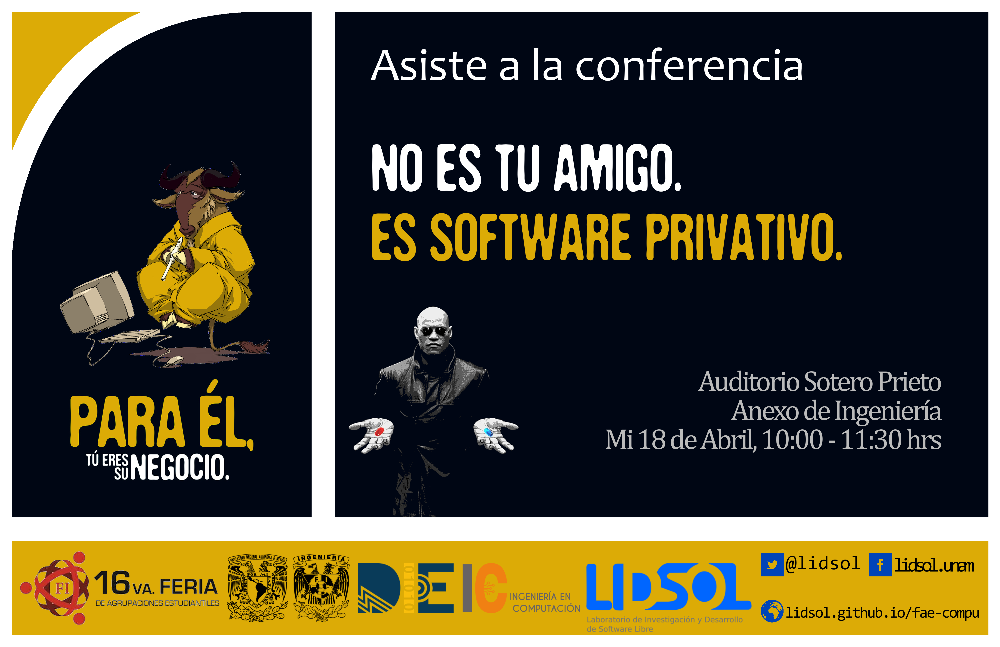
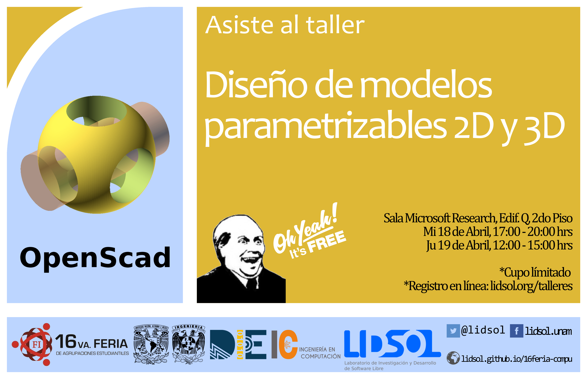

# Actividades

- **Installfest** en el stand de LIDSOL. La actividad consiste en promover el uso e instalación de distribuciones GNU/Linux para
uso personal y académico. Se asesorará de acuerdo a las necesidades de cada persona cuál es la distribución que más se adecua a ella.

  - [Ver cartel en PDF](./actividades/01_installfest/01-installfest.pdf)

- **Proyección de OpenMovies** en el iOS Lab. Esta actividad consiste en la proyección de OpenMovies durante la feria, antes y después de cada proyección se explicará cuál es la filosofía detrás de este tipo de películas, qué herramientas se utilizan y su proceso de producción.

  - [Ver el listado de OpenMovies](https://goo.gl/6Zu1Fn)
  - [Ver cartel en PDF](./actividades/02_openmovies/02-openmovies.pdf)

# Conferencias

- **No es tu amigo, es software privativo** en el auditorio Sotero Prieto. Se hablara del Software Libre y Open Source, y su impacto en la sociedad.

  - [Ver cartel en PDF](./conferencias/01_foss/01-foss.pdf)

- **¿Hiciste cambios y ya no compila? Hablemos de git** en el auditorio Sotero Prieto. Se hablara del uso de software para el control de versiones en el desarrollo de software libre.

  - [Ver cartel en PDF](./conferencias/02_git/02-git.pdf)

- **Privacidad, anonimato y derechos digitales**. Se hablara de redes de anonimato y su importancia en la defensa de los derechos digitales en la red.

  - [Ver cartel en PDF](./conferencias/03_privacidad/03-privacidad.pdf)

# Talleres

- **OpenScad para diseño de módelos parametrizables 2D y 3D** en la sala de Microsoft Research, Edificio Q, segundo piso. Este taller consiste en la presentación de OpenScad para el modelado parametrizable 2D y 3D, el cuál sirve para la elaboración de planos que puedan ser manufacturados en máquinas de diseño (cortadora láser e impresora 3D).

  - [Ver Temario](https://lidsol.org/talleres/)
  - [Ver cartel en PDF](./talleres/01_openscad/01-openscad.pdf)

 - **Tu primer PCB con KiCad** en la sala de Microsoft Research, Edificio Q, segundo piso. Este taller consiste en la presentación de KiCad para hacer placas PCB de circuitos electrónicos.

  - [Ver cartel en PDF](./talleres/02_kicad/02-kicad.pdf)

- **Gestiona tu impresora 3D en línea** en la sala de Microsoft Research, Edificio Q, segundo piso. En esta actividad se pretende mostrar todo lo que se necesita para monitorear y administrar
una impresora 3D.

  - [Ver cartel en PDF](./talleres/03_impresion3d/03-impresion3d.pdf)

- **Cómo contribuir a Firefox sin saber programación** en la sala de Microsoft Research, Edificio Q, segundo piso. En este taller se mostrará como instalar y configurar Firefox Nightly, se explicará la importancia de contribuir con pruebas en un software en etapa beta, cómo probarlo y reportar bugs.

  - [Ver cartel en PDF](./talleres/04_nightly/04-nightly.pdf)

