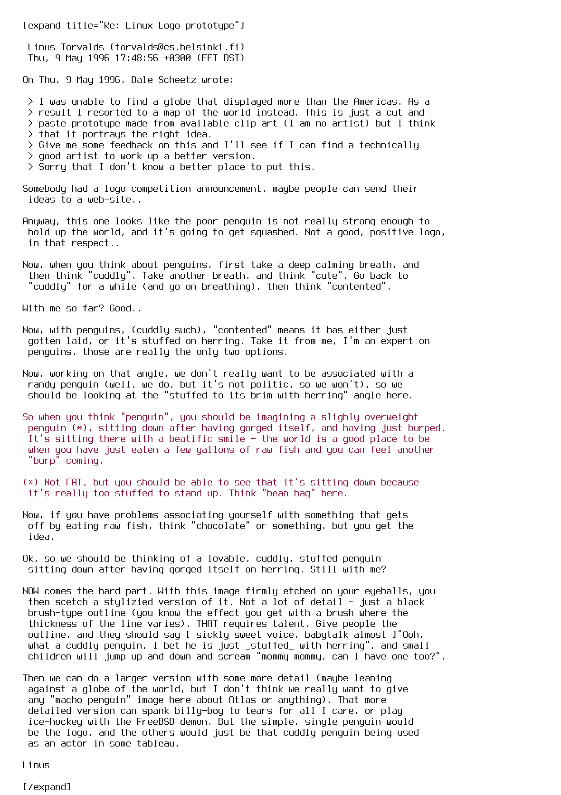
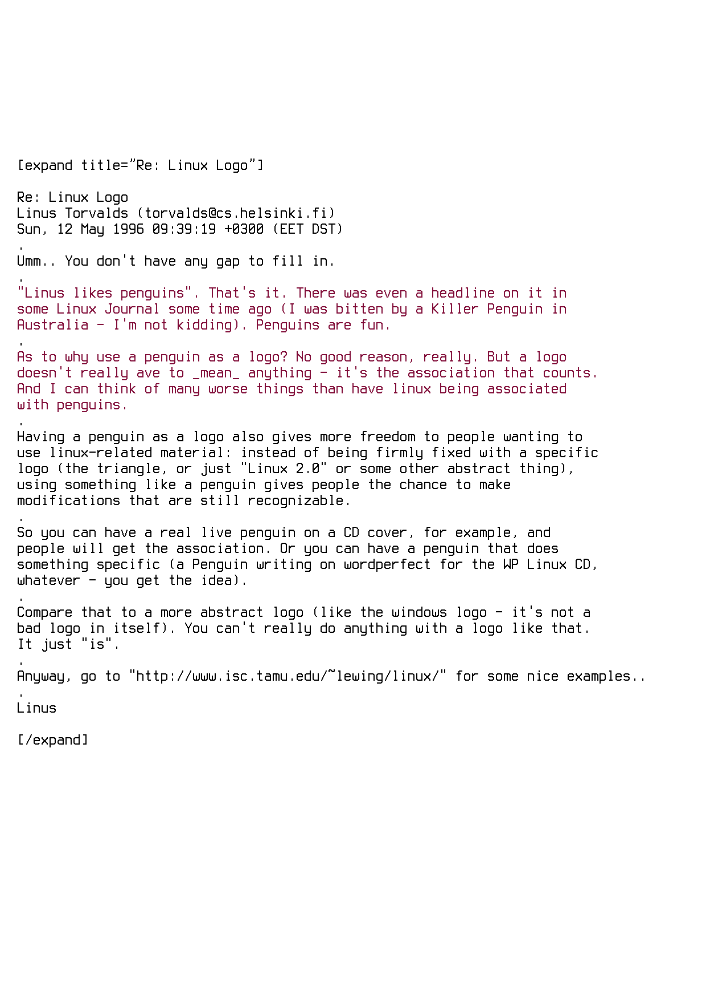

# Origen de tres mascotas del mundo del Software Libre

En esta edición del Nigromante están destacadas las mascotas, es por eso que desde LIDSOL no queriamos  dejar pasar tan perfecta oportunidad para hablar sobre algunas de las mascotas del mundo que tanto amamos, desde el conocido pingüinito y el olvidado ñu, hasta el inventado *gimp*.

Empezaremos por **Tux**, a quien seguro ya conoces incluso si no sabes demasiado sobre software libre, *¿apostamos?*.

Tux es el **pingüino**, *¿gané?*, seguro que sí, y esque al ser la mascota oficial del kernel Linux, Tux es el animal más famoso y conocido  dentro del software libre.

Sus orígenes se remontan a el 2 de mayo de 1996, cuando en la mailing list linux-kernel se abre un debate en donde Alan Cox propone desarrollar un logo para Linux. Unos días después, el 9 de mayo de 1996 Linus Torvalds (fundador de Linux) propone que sea un pingüino.

Después de constantes preguntas de por qué un pingüino, el 12 de mayo de 1996 Linus Torvalds básicamente dice que porque le gustan los pingüinos y cuenta una pequeña anécdota, aunque reconoce que no hay alguna buena razón que justifique sea el logo, lo quiso así, no hay más. Finalmente el nombre se decide en la lista de correos el 10 de junio de 1996.

De todas las propuestas que surgieron del concurso, la que más votos a favor tuvo fue la de Larry Ewing, que se diseño en GIMP, el programa al cual representa la mascota de la que hablaremos a continuación.

**Wilber** es la mascota oficial del proyecto GIMP, la alternativa libre a Photoshop. Wilber al igual que Tux ha sido dibujado usando GIMP. Ahora, tomate un tiempo para observarlo, *¿puedes adivinar que animal es?*, coyote, zorro o ratón son los animales más comunes a los que se le asocia, pero según su creador, Wilber es *[redoble de tambores]* **un gimp**, sí así como lo lees, aquí en el mundo del software libre los creadores se pasan de creativos, *¿no crees? xD*

Finalmente, pero no menos importante el logo de Sistema Operativo 

[Referencia 1](http://vivaelsoftwarelibre.com/la-mascota-de-linux-es-un-pinguino/)
[Referencia 2]()
