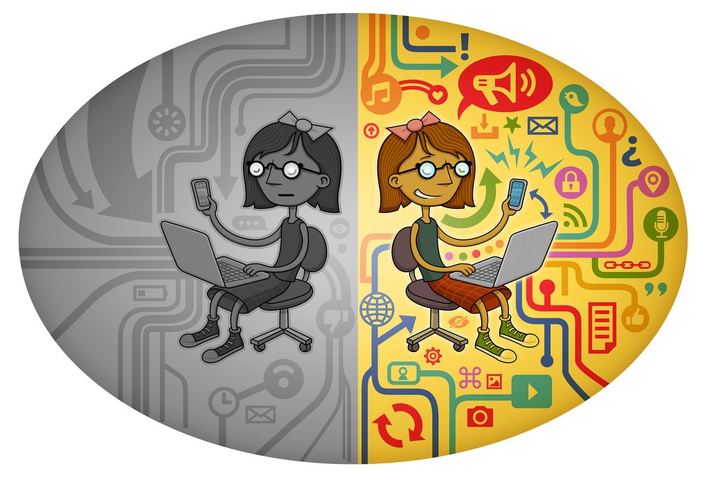

# Sobre la Neutralidad de la red
En está edición de Nigromante se está hablando de Internet. Si, ese *ente* enorme e invisible que nos ha interconectado como nunca antes con el mundo entero. Internet es la fuente de información que utilizamos diariamente por la gran cantidad de información disponible, su rapidez y por su fácil acceso. Sin embargo la ruptura de la **Neutralidad de la Red** hace que la afirmación anterior cambie de forma abrumpta. En LIDSOL estámos absolutamente convencidos de que la información debe fluir libremente en un espacio comunitario de intercambio como lo es Internet y por ello hoy hablaremos de la *Neutralidad de la Red*.

## ¿Qué es Neutralidad de la Red?
Se sabe que el contenido sobre gatitos en Internet es abundante y es un hecho que muchas personas disfrutamos de sus adorables e irresistibles bigotes. Pero, ¿Imaginas un escenario dónde debas pagar más dinero solo por querer ver contenido con adorables gatitos? Es un planteamiento extremo pero que es realidad en Estados Unidos de Norteamérica dados los acontecimientos recientes. El 14 de Diciembre del 2017 se aprobó con tres votos a favor, de los republicanos, y dos en contra, de los democratas, por la ruptura de la neutralidad de la red con lo que dan capacidades a los IPS (Internet Provider Service o Provedor de servicios de Internet) de los siguientes puntos:

1. Favorecer o límitar tipos de tráfico específicos
2. Discriminación de datos bajo intereses particulares
3. Otorgar privilegios con base en tu poder adquisitivo

Internet ya no se considerará como un servicio básico (como lo son el agua o la luz). Esto es muy importante ya que desde el 2011 la **Asamblea General de las Naciones Unidad declaró el acceso a Internet como derecho humano**.
> La única y cambiante naturaleza de internet no sólo permite a los individuos ejercer su derecho de opinión y expresión, sino que también forma parte de sus derechos humanos y promueve el progreso de la sociedad en su conjunto - **Frank La Rue, Relator Especial de la ONU**

La ruptura de la neutralidad de la red quiere decir que ya no se tendrá una navegación **igualitaria**. Entendiendo que el concepto de neutralidad de la red hace referencia que todo el tráfico que existe en Internet debe ser tratado por igual independientemente de su tipo y su procedencia. Destruir dicha neutralidad nos afecta como ciudadanos de Internet. Si la información no es libre y tiene restricciones impuestas por las compañias de telecomunicaciones o entidades gubernamentales se pierde la capacidad de decisión sobre lo que se desea consumir, aportar y críticar en línea. En primera instancia, los bolsillos se ven mermados solo por el tipo de información que nos interése. Por otra parte, pequeño creadores de contenido verían comprometido su alcanze ya que muchos clientes o visitantes tendrían obstaculos para lograr la interacción.

> [Imagen](https://www.reddit.com/r/pics/comments/9yj1f/heres_a_new_scenario_i_just_created_illustrating/) por [quink](https://www.reddit.com/user/quink) usuario de reddit

En ese sentido, el poder de los IPS sobre qué vemos y cómo lo vemos afecta proyectos como la **red TOR** (The Onion Router o El enrutamiento cebolla) que pretende brindar una navegación por la red de forma anónima o el uso de algun servicio de VPN (Virtual Private Network o Red privada virtual). Esto nos deja aun más vulnerables si queremos hacer valer nuestro derecho a la privacidad y anonimato quedando disponible solo en función de nuestra capacidad económica. Recordemos que la **privacidad** en el Artículo 12 de la *Declaración Universal de los Derechos Humanos* de la *Asamblea General de las Naciones Unidad* es un **derecho humano**:
> Nadie será objeto de injerencias arbitrarias en su vida privada, su familia, su domicilio o su correspondencia, ni de ataques a su honra o a su reputación. Toda persona tiene derecho a la protección de la ley contra tales injerencias o ataques.

Por ahora es un hecho en Estados Unidos la ruptura de la Neutralidad de la Red y el panorama no es muy alentador. Por ejemplo, en México está el caso de **Cambridge Analytica**. Esta empresa se dedica a la influencia política en procesos electorales por medio de la manipulación masiva de datos. A participado activamente en acontecimientos como la campaña electoral de Donald Trump y en la votación para que el Reino Unido **abandonara** a la Unión Europea. Todo indica que Cambridge Analytica tuvo presencia en el país desde el año 2017 y ofrecía sus servicios con vista a las elecciones proximas para la presidencia. Esto es importante dado el escandalo relacionado con la obtención obsena de cincuenta millones de perfiles de Facebook que fueron recogidos para análisis. Si la red no es neutral las operadoras podrían dar mayores facilidades a este tipo de empresas (más de las que ya tienen) para, por ejemplo, obtener nuestros datos en la red.

Para concluir, es posible que operadoras de Internet de diferentes países quieran impulsar iniciativas similares para una regulación con sus respectivos gobiernos. Si queremos disfrutar de Internet tal como lo conocemos y abogamos por la libertad lo que nos queda hacer es defender iniciativas como [Save the Internet](https://www.savetheInternet.com/sti-home) y apoyar proyectos como [TOR](https://www.torproject.org/) o [I2P](https://geti2p.net/en/). Internet lo construimos nosotras y merecemos garantías sobre nuestros derechos digitales.
### Referencias
* [La muerte de la neutralidad de la red](https://www.genbeta.com/web/la-muerte-de-la-neutralidad-de-la-red-es-un-hecho-en-estados-unidos-y-ahora-que)
* [Entrada en reddit de la imagen](https://www.reddit.com/r/pics/comments/9yj1f/heres_a_new_scenario_i_just_created_illustrating/)
* [Declaración universal de los derechos humanos](https://www.un.org/es/universal-declaration-human-rights/)
* [Internet como derecho humano](http://cnnespanol.cnn.com/2011/06/09/el-acceso-a-internet-un-derecho-humano-segun-la-onu/)
* [Escandalo de Cambridge Analytica](https://www.derechosdigitales.org/11978/cambridge-analytica-el-proximo-escandalo-esta-a-la-vuelta-de-la-esquina/)
* [Cambridge Analytica en México](https://elpais.com/internacional/2018/03/21/mexico/1521592636_991451.html)
