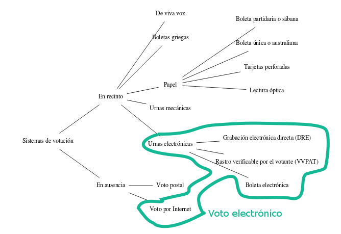
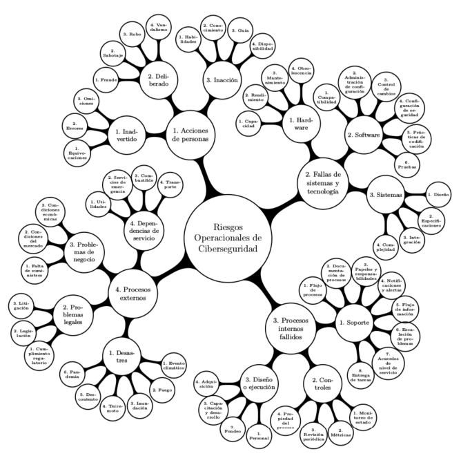

# Introducción al Voto Electrónico
## Por Yesica Navarro (@yesn7)
En este mes de Julio, desde *LIDSOL* queremos hablarles del tan aclamado voto electrónico, (sí, ese del que hablan [aquí](http://www.milenio.com/opinion/julian-german-molina-carrillo/sociedad-derechos-humanos/sistema-de-votacion-electronica-o-voto-electronico), [aquí](https://expansion.mx/tecnologia/2018/06/12/voto-electronico-en-mexico-se-puede-aplicar?internal_source=PLAYLIST) y [aquí](http://www.nacion321.com/elecciones/mexico-ya-ha-votado-en-urnas-electronicas-y-aqui-la-prueba) como si fuera una maravilla, y qué debería implementarse lo antes posible por sus múltiples beneficios).

El **voto electrónico** es áquel en el que (por más redundante que suene) se utilizan medios electrónicos, lo cuáles he resaltado en el siguiente diagrama:

Vamos a enfocarnos en las **urnas electrónicas**, a continuación listo, los beneficios más comunmente resaltados por sus partidarios:
- **Disminución de costos.**

Se argumenta así porque las urnas se pueden reutilizar, muy contrario al voto tradicional, donde se deben imprimir nuevas boletas en cada elección. Y aunque resulta una ilusión bastante convincente, es eso, una ilusión, pues no se estan considerando diversos factores, los cuáles son:
  - Las urnas al ser hackeables deben tener vigilancia todo el tiempo (a diferencia del proceso tradicional que se necesita vigilancia sólo algunas semanas)
  - Si hay algún proceso electoral controvertido (como el que vivimos en 2006) tendríamos que renunciar a la verdad o resguardarlas (y adquirir más)
  - Costos de desarrollo
  - Costos de capacitación en seguridad digital a los operadores
  - Viabilidad de traslado
  - ... y la lista sigue en [[2]](http://ru.iiec.unam.mx/110/)

- **Agilidad en la obtención de resultados.**

Esta percepción es así, porque creemos que al realizarse con una computadora todo será más rápido, sin embargo las urnas electrónicas son dispositivos que **no** se conectan a internet [[2]](http://ru.iiec.unam.mx/110/) y por ahora son sólo una herramienta de conteo de votos,  y aún se debe hacer una comunicación manual de los resultados obtenidos por la urna al centro de control de la autoridad electoral, es decir, el tiempo de disminución de proceso electoral son aproximadamente dos horas.

- **Confiabilidad de los actores.**

En este punto se argumenta que una computadora es más confiable, pero quién argumenta esto, seguramente no es un experto en seguridad, ya que al migrar a este tipo de sistemas se heredan los riesgos operacionales de ciberseguridad (*y sin ir más lejos para no sonar como una loca al hablar de que incluso los componentes electrónicos con los que están fabricados las urnas podrían estar modificados*) mostrados en el siguiente árbol.

 Estos mismos expertos argumentan que una de las muchas virtudes del sistema tradicional es que cualquier persona que sepa leer, escribir y sepa aritmética elemental puede someter el sistema a escrutinio, una característica escencial en el ejercicio de la democracia y que se pierde con la implementación de la urna, en la que se necesitan conocimientos más complejos para esta misma verificación.

Con este simple anális nos podemos dar cuenta de que los argumentos de los simpatizantes de la urna pueden revertirse y la postura de los expertos en seguridad es clara, el voto electrónico no es confiable, y la mejor opción es el voto tradicional.  

Sin embargo, eso no ha evitado que desde la primera implementación del voto en Holanda en 1965 (y revertida en 2008) éste se abriera paso e incluso se realizaran votaciones con este sistema en  nuestro país en  elecciones piloto con urna en 2012 y en línea en 2015.

Esto ha sido así, porque el voto electrónico ha sido apoyado desde distintas disciplinas, en donde presentan muchas características *con fundamentos matemáticos* como verdaderas, cuando estas *garantías* no se cumplen en la implementación.

Lo más curioso, es que un argumento común desde las disciplinas de Humanidades y Ciencias Sociales es que una de las dificultades que se presentan ante el voto electrónico es la resistencia social, la desconfianza que generan los medios electrónicos el electorado, derivada de las distintas clases económicas y educación, sin embargo resulta irónico que, son los expertos en seguridad los más desconfiados, y son ellos quiénes encuentran peligrosa cantidad de errores técnicos en sus publicaciones.

Sin embargo hay algo muy acertado en su visión, si la adopción del voto electrónico es inminente *(ya sea porque las manos que tiran de hilos invisibles así lo decidieron o por que somos tan adictos a las TICs que terminan por convencernos de que es una buena idea)*
>>Es inaplazable, en materia electoral, contar con todas las hipótesis legales que pueden desprenderse del propio uso de la informática electoral, especialmente
de las urnas electrónicas.

Debe comenzar un trabajo **real** multidisciplinario, en donde los expertos en derecho, conversen con los expertos de seguridad y se encaminen, *por ejemplo*, **auditorías plenas y abiertas obligatorias**, se asegure la **capacitación y evaluación para el personal en materia de seguridad informática**, se asegure la libertad de los votantes al voto blanco como medio de protesta y  muchas más, que seguro ellos **juntos** podrían encontrar, y es que no es posible que mientras los expertos de seguridad lograron avanzar de las urnas DRE a las VVPAT (para que el voto no estuviera *únicamente* en la memoria electrónica y existiera un comprobante para poder contar los votos en caso de impugnación) existan apartados de publicaciones de la ONPE (autoridad electoral de Perú)  en que se argumente que esto es *una erronea concepción de contadores de que siempre han dejado las transacciones con un rastro en papel*.

**#HáganloMejor**

## Referencias
Todas las imágenes de este artículo fueron reproducidas con el consentimiento expreso del Mtro. Gunnar Eyal Wolf Iszevich del trabajo [[1] Análisis Comparativo de Incidentes en la Aplicación del Voto Electrónico](http://ru.iiec.unam.mx/4097/).

[[2] Wolf, Gunnar (2010): Voto electrónico: Un peligro para la democracia. Ventana Informática (23). pp. 181-195. ISSN 0123-9678 ](http://ru.iiec.unam.mx/110/)

[[3] Wolf, Gunnar (2011): Voto electrónico: ¿quién tiene realmente la decisión? In: Construcción Colaborativa del Conocimiento. Universidad Nacional Autónoma de México. Instituto de Investigaciones Económicas, pp. 285-301. ISBN 978-607-02-2373-0 ](http://ru.iiec.unam.mx/2358/)

[[4] Wolf, Gunnar (2012): Voto Electrónico, 2012: ¿Cómo vamos? Software Gurú (37). pp. 44-45. ](http://ru.iiec.unam.mx/1812/)

[[5] Wolf, Gunnar (2012): México, el voto electrónico y el 2012. Revista .Seguridad: Cultura de prevención para TI (14). ](http://ru.iiec.unam.mx/1813/)

[[6] Soldevilla, Fernando Tuesta (2004). “El voto electrónico”. En: Elecciones. Oficina Nacional de Procesos Electorales, págs. 55-80.](https://www.web.onpe.gob.pe/modEducacion/Publicaciones/L-0026.pdf#page=51)

[[7] Romero Flores, Rodolfo y Julio Alejandro Téllez Valdés (2010).Voto electrónico, derecho y otras implicacio-
nes. Universidad Nacional Autónoma de México. isbn: 978-60-7021-297-0](https://archivos.juridicas.unam.mx/www/bjv/libros/6/2801/2.pdf)

[[8] Téllez Valdés, Julio. (2010). El voto electrónico. Serie Temas Selectos de Derecho Electoral; 14, 59 pp. ](http://www.te.gob.mx/documentacion/publicaciones/Temas_selectos/14_voto.pdf)

### PD.
Este es un artículo divulgativo y espero que le sirva a cada lector como una mera introducción (de ahí su nombre) a este tema, por lo me gustaría que el o la lectora fuera más allá, y lea las referencias, porque hay muchas cosas que por espacio (y tiempo) no pude añadir, como el hecho de que una persona podía con un detector de ondas electrómagneticas conocer por quién se votaba, o el hecho de *Las urnas electrónicas utilizadas en Tuxcueca, fueron pantallas
de punto de venta de restaurantes, cuyo costo oscila entre 2,500 y
3,000 dólares y fueron regaladas por la empresa Toshiba para abrir
el  mercado  en  México*  (un mercado ultra conveniente!!! seeeh!) y muchos otros casos más, que me parece que es fundamental que todxs tengamos conocimiento. Cualquier duda o aclaración estamos ubicados en el 2do piso del P, en el Anexo de Ingeniería, FI, UNAM.
